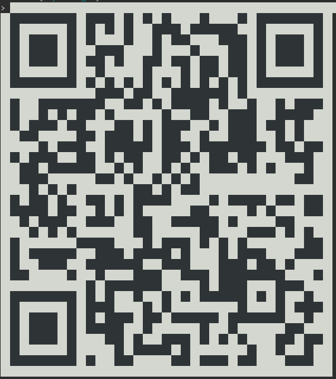

<h1 align="center">Welcome to wifi-qr-code-generator 👋</h1>
<p>
  
  <a href="https://github.com/fantasywidgets/wifi-qr-code-generator/actions?query=workflow%3A%22Node.js+CI%22" target="_blank">
    
  </a>
  <a href="https://github.com/fantasywidgets/wifi-qr-code-generator#readme" target="_blank">
    
  </a>
  <a href="https://github.com/fantasywidgets/wifi-qr-code-generator/graphs/commit-activity" target="_blank">
    
  </a>
  <a href="https://github.com/fantasywidgets/wifi-qr-code-generator/blob/master/LICENSE" target="_blank">
    
  </a>
  <a href="https://twitter.com/anoopengineer" target="_blank">
    
  </a>
</p>

⭐️ Star us on GitHub — it helps!

wifi-qr-code-generator is an npm module to generate a QR Code to connect to your WiFi. Supports WiFi QR Codes in PNG, SVG, Terminal and UTF output formats. Works in both node server and browser.

<div align="center">
  <h3>
    <a href="https://github.com/fantasywidgets/wifi-qr-code-generator#readme">
      🏠 HomePage
    </a>
    <span> | </span>
    <a href="https://fantasywidgets.github.io/wifi-qr-code-generator">
      ✨ Demo
    </a>
    <span> | </span>
    <a href="https://github.com/fantasywidgets/wifi-qr-code-generator#usage">
      📃 Usage
    </a>
    <span> | </span>
    <a href="https://github.com/fantasywidgets/wifi-qr-code-generator/blob/master/CONTRIBUTING.md">
      🤝 Contributing
    </a>
  </h3>
</div>

## Install

Using NPM:

```sh
$ npm install wifi-qr-code-generator
```

Using Yarn:

```sh
$ yarn add wifi-qr-code-generator
```

## Usage

### Basic API — Generating a PNG QR Code

```javascript
const qrcode = require('wifi-qr-code-generator')
const pr = qrcode.generateWifiQRCode({
  ssid: 'Hello world',
  password: 'testpass',
  encryption: 'WPA',
  hiddenSSID: false,
  outputFormat: { type: 'image/png' }
})
pr.then((data) => console.log(data))
```

This prints the following output:

```
data:image/png;base64,iVBORw0KGgoAAA...
```

You can pass this data URL to an html `img` tag to generate the following QR code image:


### API Explanation

Main API call is `generateWifiQRCode` which is shown in the example above. This method takes an object of the following format:

```typescript
export interface Config {
  ssid: string
  password: string
  encryption: 'WPA' | 'WEP' | 'None'
  hiddenSSID: boolean
  outputFormat: OutputFormat
}

export interface OutputFormat {
  type: 'image/png' | 'utf8' | 'svg' | 'terminal'
}
```

1. `ssid`: string representation of your wireless SSID (Wifi name). Max length possible for WiFi SSID is 32 characters for most routers. However this library doesn't impose any limitation on the length of SSID that can be passed in.
1. `password`: string representation of your WiFi password
1. `encryption`: Possible values here are `WPA`, `WEP` and `None`. If you are using WPA2, enter `WPA`. Please note that WEP protocol has multiple security vulnerabilities and you shouldn't be configuring your WiFi router to use WEP at all.
1. `hiddenSSID`: should be `true` if your router is configured to NOT broadcast your SSID. Else `false`
1. `outputFormat`: An object that has a single `type` field

Possible values of `type` are:

1. `"image/png"`: `generateWifiQRCode` will generates a data URL representing a PNG image
1. `"svg"`: `generateWifiQRCode` will generates an SVG image in string format
1. `utf8`: `generateWifiQRCode` will generates a UTF8 representation of the QR code
1. `terminal`: `generateWifiQRCode` will generates a string that can be pretty printed as QR code in the terminal

### Generating a SVG QR Code

```javascript
const qrcode = require('wifi-qr-code-generator')
const pr = qrcode.generateWifiQRCode({
  ssid: 'Hello world',
  password: 'testpass',
  encryption: 'WPA',
  hiddenSSID: false,
  outputFormat: { type: 'svg' }
})
pr.then((data) => console.log(data))
```

This prints the following output:

```
<svg xmlns="http://www.w3.org/2000/svg" viewBox="0 0 41 41" shape-rendering="crispEdges">...
```

You can use the generated SVG directly in your HTML page to display the QR code.

<div style="width:150px;height:auto">
<svg xmlns="http://www.w3.org/2000/svg" viewBox="0 0 41 41" shape-rendering="crispEdges"><path fill="#ffffff" d="M0 0h41v41H0z"/><path stroke="#000000" d="M4 4.5h7m1 0h3m1 0h1m1 0h1m1 0h1m3 0h1m3 0h1m1 0h7M4 5.5h1m5 0h1m1 0h1m1 0h1m1 0h1m2 0h3m1 0h5m2 0h1m5 0h1M4 6.5h1m1 0h3m1 0h1m1 0h1m3 0h1m2 0h1m1 0h2m3 0h3m1 0h1m1 0h3m1 0h1M4 7.5h1m1 0h3m1 0h1m2 0h3m3 0h1m3 0h1m3 0h2m1 0h1m1 0h3m1 0h1M4 8.5h1m1 0h3m1 0h1m1 0h2m1 0h1m2 0h2m1 0h2m1 0h2m1 0h2m1 0h1m1 0h3m1 0h1M4 9.5h1m5 0h1m2 0h1m4 0h1m3 0h1m1 0h2m1 0h2m1 0h1m5 0h1M4 10.5h7m1 0h1m1 0h1m1 0h1m1 0h1m1 0h1m1 0h1m1 0h1m1 0h1m1 0h1m1 0h7M13 11.5h3m1 0h2m2 0h6m1 0h1M4 12.5h1m2 0h7m2 0h2m1 0h1m1 0h4m1 0h1m2 0h1m2 0h1m1 0h3M4 13.5h1m2 0h1m1 0h1m1 0h2m1 0h1m5 0h1m2 0h2m2 0h3m2 0h4M4 14.5h1m1 0h3m1 0h2m3 0h2m1 0h1m1 0h3m2 0h1m1 0h3m1 0h2m1 0h1M5 15.5h2m4 0h2m1 0h3m1 0h1m1 0h2m2 0h1m2 0h3m2 0h1m1 0h1M7 16.5h1m1 0h3m2 0h5m1 0h3m1 0h7m1 0h2m1 0h2M4 17.5h1m1 0h3m2 0h2m1 0h1m1 0h2m2 0h2m1 0h1m1 0h2m1 0h2m3 0h3M5 18.5h2m1 0h5m2 0h1m1 0h1m2 0h1m1 0h1m2 0h3m1 0h1m1 0h1m3 0h1M5 19.5h3m5 0h2m1 0h1m2 0h1m1 0h1m1 0h1m10 0h2M6 20.5h1m1 0h1m1 0h1m6 0h2m1 0h1m1 0h2M4 21.5h1m1 0h2m1 0h1m2 0h2m1 0h1m1 0h4m4 0h1m1 0h4m1 0h2m1 0h2M4 22.5h4m1 0h2m2 0h1m1 0h1m1 0h1m5 0h2m4 0h1m1 0h1m3 0h2M5 23.5h1m1 0h3m2 0h3m2 0h2m2 0h5m1 0h1m4 0h2M6 24.5h1m1 0h1m1 0h1m6 0h2m5 0h2m3 0h3m1 0h1m1 0h1M4 25.5h1m6 0h4m3 0h1m1 0h3m1 0h1m1 0h1m1 0h1m6 0h2M4 26.5h1m1 0h5m2 0h3m1 0h4m1 0h1m3 0h1m1 0h3m3 0h3M4 27.5h1m2 0h3m2 0h6m2 0h3m3 0h3m1 0h2m1 0h1M4 28.5h2m4 0h1m2 0h1m3 0h3m2 0h3m1 0h7m3 0h1M12 29.5h1m1 0h6m4 0h1m1 0h3m3 0h3M4 30.5h7m1 0h1m1 0h1m2 0h1m2 0h1m1 0h1m1 0h5m1 0h1m1 0h1m2 0h1M4 31.5h1m5 0h1m1 0h3m3 0h1m1 0h1m7 0h1m3 0h1m1 0h3M4 32.5h1m1 0h3m1 0h1m1 0h1m1 0h3m1 0h2m1 0h5m1 0h6m2 0h1M4 33.5h1m1 0h3m1 0h1m1 0h4m2 0h1m5 0h1m2 0h1m5 0h2M4 34.5h1m1 0h3m1 0h1m3 0h2m1 0h1m2 0h3m1 0h1m1 0h1m1 0h1m3 0h2m1 0h2M4 35.5h1m5 0h1m4 0h1m1 0h4m1 0h1m6 0h1m2 0h1m2 0h1M4 36.5h7m1 0h1m2 0h2m4 0h2m1 0h3m1 0h2m3 0h3"/></svg>
</div>

### Generating a UTF8 QR Code

```javascript
const qrcode = require('wifi-qr-code-generator')
const pr = qrcode.generateWifiQRCode({
  ssid: 'Hello world',
  password: 'testpass',
  encryption: 'WPA',
  hiddenSSID: false,
  outputFormat: { type: 'utf8' }
})
pr.then((data) => console.log(data))
```

This prints the following output:

```

    █▀▀▀▀▀█ █▀█ █ ▀▄█▄ ▄█▄▄▄▀ █▀▀▀▀▀█
    █ ███ █ ▀▄▄▄▀  █ ▀▀▄  ▀██ █ ███ █
    █ ▀▀▀ █ ▀█ ▀  █▀ ▀█ ██ ██ █ ▀▀▀ █
    ▀▀▀▀▀▀▀ ▀▄█▄▀▄█ ▀▄█▄█▄█ █ ▀▀▀▀▀▀▀
    █  █▀█▀██▀▄ ▀▀ ▀▄▀▀██ ▀▄▄█  █▄██▀
    ▀▄█▀▀ ▀█▄ ▄██ █ ██▀ ▄▀ ███ ▀█ █
    ▄ ▄█▄▀▀█▄ █▀██▀ ██▀▄▀██▀██▀ ▀█▄█▀
     ██▄▀▀▀▀▀▄▄▀▄▀ ▄▀▄▀▄ ▀▀▀ ▀ ▀  ▄█
    ▄ █▄▀▄▀ ▄▄ ▄ ██▄█ ▀▀ ▄ ▄▄▄▄ ▄▄ ▄▄
    ▀█▀█▄█▀ ▄█▄▀ █▄  ▄▄██▄ ▄ ▀ ▀▄▄ ▀▀
    ▄ ▀ ▀ ▀▄▄▄▄  ▀█ ▄▄▄ █▀▄ ▄▀▀▀ ▀ █▄
    █ ▀███▀ ▄███▄█▀▀█▄█   █▄█▀█▄ ▄▀▀▀
    ▀▀    ▀ ▄▀▄▄▄███  ▀▀█ ███▀▀▀█▄▄ ▀
    █▀▀▀▀▀█ █▄█  ▀▄ █ ▀ ▀▀▀▀█ ▀ █ ▄█▄
    █ ███ █ █▄██▀ █▀ ▀▀▀█▀ █▀▀▀▀▀▄▄▀
    █ ▀▀▀ █   ▀█ █▄▄█▀█ ▀ ▀ ▀▄  █▀ █▀
    ▀▀▀▀▀▀▀ ▀  ▀▀    ▀▀ ▀▀▀ ▀▀   ▀▀▀
```

### Generating a Terminal QR Code

```javascript
const qrcode = require('wifi-qr-code-generator')
const pr = qrcode.generateWifiQRCode({
  ssid: 'Hello world',
  password: 'testpass',
  encryption: 'WPA',
  hiddenSSID: false,
  outputFormat: { type: 'terminal' }
})
pr.then((data) => console.log(data))
```

This generates the following QR code in your terminal:



## Author

👤 **Anoop Kunjuraman**

- Website: https://anoop.kunjuraman.com
- Twitter: [@anoopengineer](https://twitter.com/anoopengineer)
- Github: [@anoopengineer](https://github.com/anoopengineer)
- LinkedIn: [@anoopkunjuraman](https://linkedin.com/in/anoopkunjuraman)

## 🤝 Contributing

Contributions, issues and feature requests are welcome!<br />Feel free to check [issues page](https://github.com/fantasywidgets/wifi-qr-code-generator/issues). You can also take a look at the [contributing guide](https://github.com/fantasywidgets/wifi-qr-code-generator/blob/master/CONTRIBUTING.md).

## Show your support

Give a ⭐️ if this project helped you!

## 📝 License

Copyright © 2020 [Anoop Kunjuraman](https://github.com/anoopengineer).<br />
This project is [MIT](https://github.com/fantasywidgets/wifi-qr-code-generator/blob/master/LICENSE) licensed.

---

_This README was generated with ❤️ by [readme-md-generator](https://github.com/kefranabg/readme-md-generator)_
